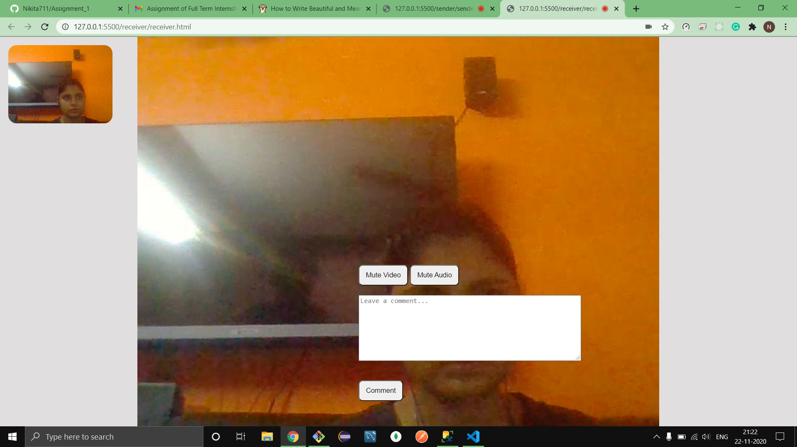

## video-communication service

This is a Video Calling Application with WebRTC in javascript. 

There are two interfaces to create a contrast , one for the sender and the other for the participants . Make sure to enter your name first and then start the call . I've used websockets as they provide full duplex communication i.e once the client and the server connection is estabilished, they can send receive data continuosly with reconnecting again and again .

## Other things to keep in mind while running this program

#### node.js should be installed in your computer

#### install websocket.io
npm intall websocket.io

## to run the code 

type node server.js 

